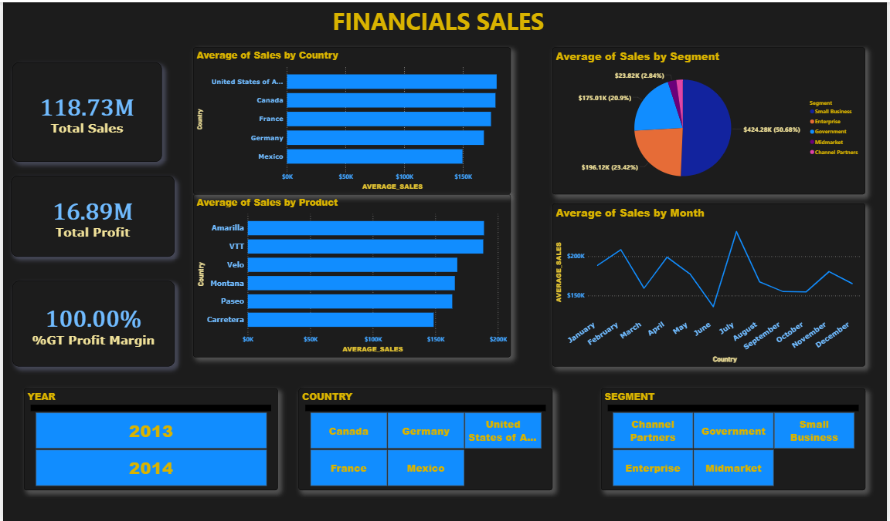

<!DOCTYPE html>
<html lang="en">
<head>
     <meta charset="UTF-8">
    
</head>
<body>

  <h1>📊 Retail Sales Dashboard (Power BI)</h1>

  <h1>📸 Dashboard Preview</h1>
    

  <h1>📁 Project Overview</h1>
    
This Power BI project visualizes retail sales data. It includes key metrics like total sales, profit margin, and sales trends. Interactive visuals allow filtering by year, country, and customer segment.

  <h1>📦 Dataset</h1>
    
<strong>Source:</strong> Microsoft Financial Sample Dataset (Excel format)

  <h1>🔍 Dashboard Features</h1>
    <ul>
        <li>Total Sales and Total Profit KPIs</li>
        <li>Profit Margin Calculation</li>
        <li>Sales by Country and Product</li>
        <li>Sales by Segment (Pie Chart)</li>
        <li>Monthly Sales Trend (Line Chart)</li>
    </ul>

  <h1>🧮 Key DAX Measures</h1>
    <ul>
        <li><code>Total Sales = SUM(Financials[Sales])</code></li>
        <li><code>Total Profit = SUM(Financials[Profit])</code></li>
        <li><code>Profit Margin = DIVIDE([Total Profit], [Total Sales], 0)</code></li>
    </ul>

  <h1>👨‍💻 Author</h1>
    
<strong>JUNAID KHAN</strong> Power BI Developer & Data Analyst

</body>
</html>
